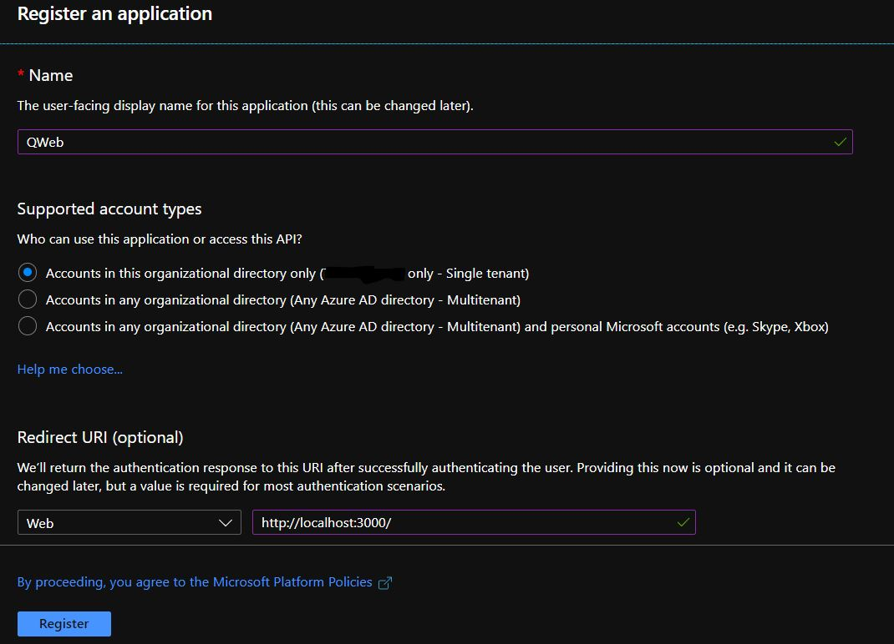
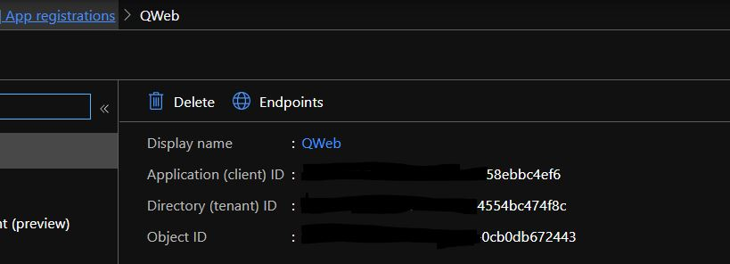
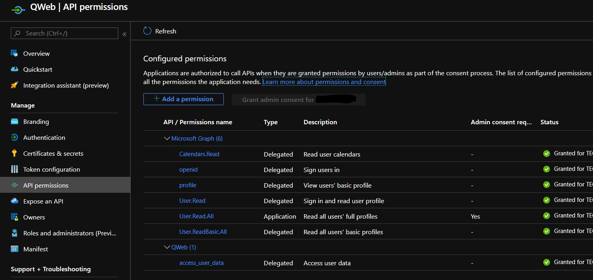
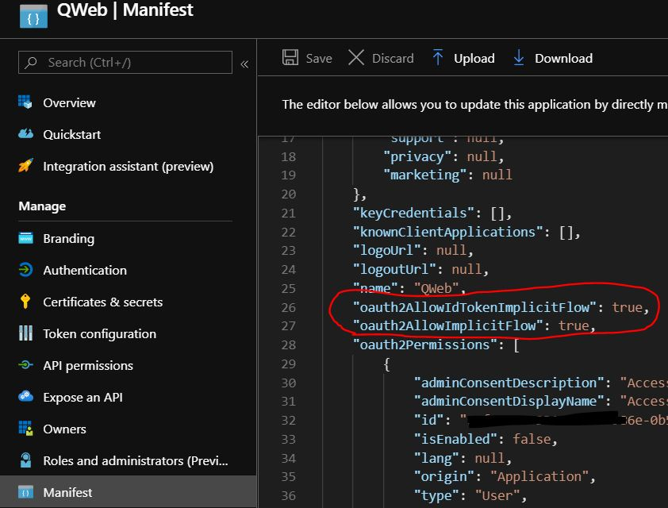
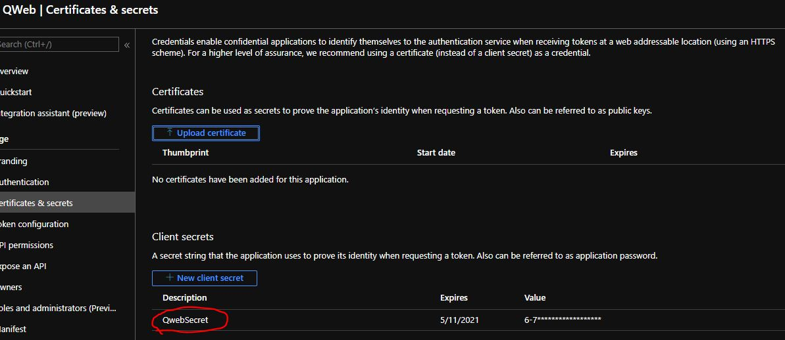
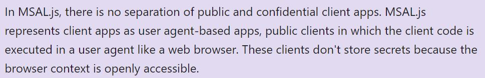
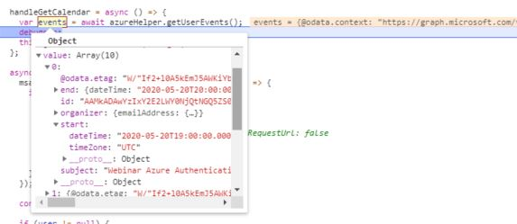

## Azure Authentication with React, MSAL (Microsoft Authentication Library) and Microsoft Graph

#### Tools

- Microsoft Authentication Library: `npm install msal`
- Microsoft Graph JavaScript Client Library: `npm install @microsoft/microsoft-graph-client`
- Microsoft Graph TypeScript Types: `npm install @types/microsoft-graph`

#### App Registration

First, you need to register your app.

#### The Registered App with Its Application Id

#### API Permissions

These are the scopes you request a token for

#### Enable Implicit Flow in Manifest

#### Client Secrets

This is useful when you want to query MS Graph with permission scopes of type Application, not Delegated. When you want
to query things in the context of the application and not the user's context and token.
For example: when querying a list of users with the scope User.ReadBasic.All, maybe you would not want to give your users the permission to read other users profiles and want the application to be responsible for that.

#### Note from Microsoft

#### Querying calendars

#### Final thoughts

There's more than one way to skin a cat. This is just a simple way to to use MSAL to authenticate in Azure and query MS Graph.

Keep on!
